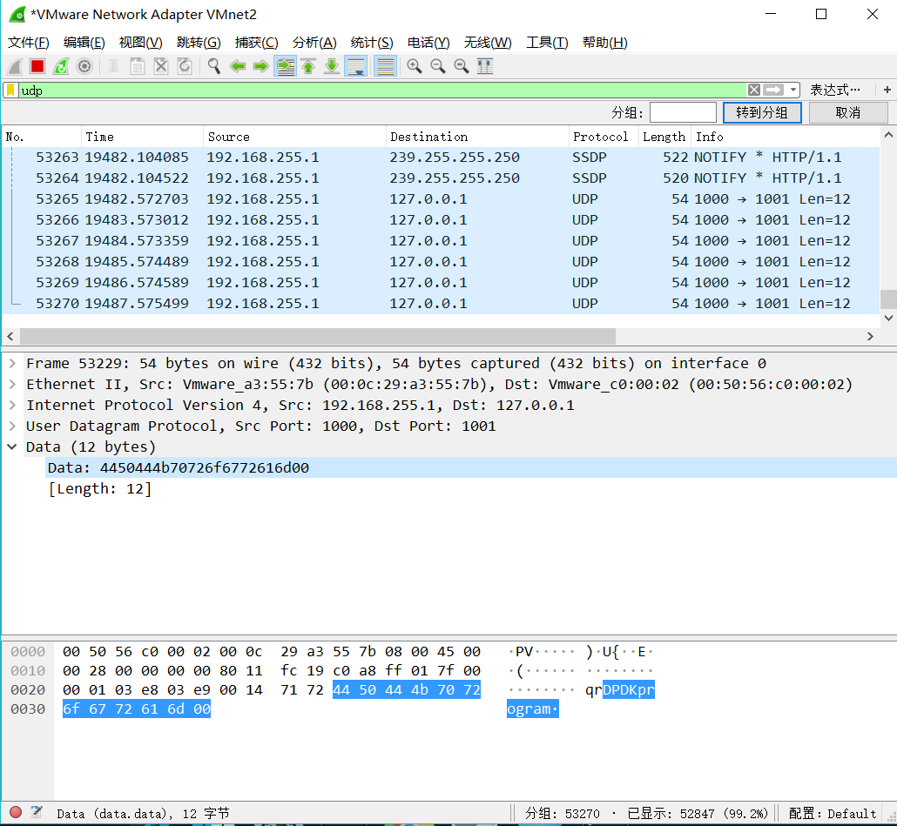

### Lab2 Report

##### 516030910422 赵樱
---

#### Part1：Get Familiar With DPDK 
Q1: What’s the purpose of using hugepage?

- 利用内存大页可以存更多TLB索引，降低TLB miss, 减少访存的开销、提升性能。


Q2: Take examples/helloworld as an example, describe the execution flow of DPDK programs?
    
1. main函数：主线程运行入口。
2. 调用rte_eal_init函数：初始化基础运行环境。该函数读取入口参数，构建一个针对包处理设计的运行环境，其中一个参数```" -c <core mask>"``` 指定需要参与运行的线程（核）集合。
3. 程序会试图独占运行在逻辑核(lcore)上，进行多核运行初始化。```RTE_LCORE_FOREACH_SLAVE()```遍历所有指定可以使用的lcore; 通过```rte_eal_remote_launch()```在每个lcore上启动从线程，每个从线程都运行```lcore_hello()```函数，打印出相应的lcore_id。


Q3: Read the codes of examples/skeleton, describe DPDK APIs related to sending and
    receiving packets.

```
// 收发包前的设备、队列、接口的配置和初始化
rte_eth_dev_configure()
rte_eth_rx_queue_setup()
rte_eth_tx_queue_setup
rte_eth_dev_start(port)

// 收包函数，参数：端口id、队列id、缓冲区、队列长度
rte_eth_rx_burst(port_id, queue_id, rte_mbuf, nb_pkts)

// 发包函数，参数：端口id、队列id、缓冲区、发包数
rte_eth_tx_burst(port_id, queue_id, rte_mbuf, nb_pkts)

// 发送失败的包需要手动调用该函数释放
rte_pktmbuf_free(mbuf)
```
  
Q4: Describe the data structure of ‘rte_mbuf’.
```c
struct rte_mbuf {
	MARKER cacheline0;

	void *buf_addr;           /**< Virtual address of segment buffer. */
	/**
	 * Physical address of segment buffer.
	 * Force alignment to 8-bytes, so as to ensure we have the exact
	 * same mbuf cacheline0 layout for 32-bit and 64-bit. This makes
	 * working on vector drivers easier.
	 */
	RTE_STD_C11
	union {
		rte_iova_t buf_iova;
		rte_iova_t buf_physaddr; /**< deprecated */
	} __rte_aligned(sizeof(rte_iova_t));

	/* next 8 bytes are initialised on RX descriptor rearm */
	MARKER64 rearm_data;
	uint16_t data_off;

	/**
	 * Reference counter. Its size should at least equal to the size
	 * of port field (16 bits), to support zero-copy broadcast.
	 * It should only be accessed using the following functions:
	 * rte_mbuf_refcnt_update(), rte_mbuf_refcnt_read(), and
	 * rte_mbuf_refcnt_set(). The functionality of these functions (atomic,
	 * or non-atomic) is controlled by the CONFIG_RTE_MBUF_REFCNT_ATOMIC
	 * config option.
	 */
	RTE_STD_C11
	union {
		rte_atomic16_t refcnt_atomic; /**< Atomically accessed refcnt */
		uint16_t refcnt;              /**< Non-atomically accessed refcnt */
	};
	uint16_t nb_segs;         /**< Number of segments. */

	/** Input port (16 bits to support more than 256 virtual ports). */
	uint16_t port;

	uint64_t ol_flags;        /**< Offload features. */

	/* remaining bytes are set on RX when pulling packet from descriptor */
	MARKER rx_descriptor_fields1;

	/*
	 * The packet type, which is the combination of outer/inner L2, L3, L4
	 * and tunnel types. The packet_type is about data really present in the
	 * mbuf. Example: if vlan stripping is enabled, a received vlan packet
	 * would have RTE_PTYPE_L2_ETHER and not RTE_PTYPE_L2_VLAN because the
	 * vlan is stripped from the data.
	 */
	RTE_STD_C11
	union {
		uint32_t packet_type; /**< L2/L3/L4 and tunnel information. */
		struct {
			uint32_t l2_type:4; /**< (Outer) L2 type. */
			uint32_t l3_type:4; /**< (Outer) L3 type. */
			uint32_t l4_type:4; /**< (Outer) L4 type. */
			uint32_t tun_type:4; /**< Tunnel type. */
			RTE_STD_C11
			union {
				uint8_t inner_esp_next_proto;
				/**< ESP next protocol type, valid if
				 * RTE_PTYPE_TUNNEL_ESP tunnel type is set
				 * on both Tx and Rx.
				 */
				__extension__
				struct {
					uint8_t inner_l2_type:4;
					/**< Inner L2 type. */
					uint8_t inner_l3_type:4;
					/**< Inner L3 type. */
				};
			};
			uint32_t inner_l4_type:4; /**< Inner L4 type. */
		};
	};

	uint32_t pkt_len;         /**< Total pkt len: sum of all segments. */
	uint16_t data_len;        /**< Amount of data in segment buffer. */
	/** VLAN TCI (CPU order), valid if PKT_RX_VLAN is set. */
	uint16_t vlan_tci;

	union {
		uint32_t rss;     /**< RSS hash result if RSS enabled */
		struct {
			RTE_STD_C11
			union {
				struct {
					uint16_t hash;
					uint16_t id;
				};
				uint32_t lo;
				/**< Second 4 flexible bytes */
			};
			uint32_t hi;
			/**< First 4 flexible bytes or FD ID, dependent on
			     PKT_RX_FDIR_* flag in ol_flags. */
		} fdir;           /**< Filter identifier if FDIR enabled */
		struct {
			uint32_t lo;
			uint32_t hi;
		} sched;          /**< Hierarchical scheduler */
		uint32_t usr;	  /**< User defined tags. See rte_distributor_process() */
	} hash;                   /**< hash information */

	/** Outer VLAN TCI (CPU order), valid if PKT_RX_QINQ is set. */
	uint16_t vlan_tci_outer;

	uint16_t buf_len;         /**< Length of segment buffer. */

	/** Valid if PKT_RX_TIMESTAMP is set. The unit and time reference
	 * are not normalized but are always the same for a given port.
	 */
	uint64_t timestamp;

	/* second cache line - fields only used in slow path or on TX */
	MARKER cacheline1 __rte_cache_min_aligned;

	RTE_STD_C11
	union {
		void *userdata;   /**< Can be used for external metadata */
		uint64_t udata64; /**< Allow 8-byte userdata on 32-bit */
	};

	struct rte_mempool *pool; /**< Pool from which mbuf was allocated. */
	struct rte_mbuf *next;    /**< Next segment of scattered packet. */

	/* fields to support TX offloads */
	RTE_STD_C11
	union {
		uint64_t tx_offload;       /**< combined for easy fetch */
		__extension__
		struct {
			uint64_t l2_len:7;
			/**< L2 (MAC) Header Length for non-tunneling pkt.
			 * Outer_L4_len + ... + Inner_L2_len for tunneling pkt.
			 */
			uint64_t l3_len:9; /**< L3 (IP) Header Length. */
			uint64_t l4_len:8; /**< L4 (TCP/UDP) Header Length. */
			uint64_t tso_segsz:16; /**< TCP TSO segment size */

			/* fields for TX offloading of tunnels */
			uint64_t outer_l3_len:9; /**< Outer L3 (IP) Hdr Length. */
			uint64_t outer_l2_len:7; /**< Outer L2 (MAC) Hdr Length. */

			/* uint64_t unused:8; */
		};
	};

	/** Size of the application private data. In case of an indirect
	 * mbuf, it stores the direct mbuf private data size. */
	uint16_t priv_size;

	/** Timesync flags for use with IEEE1588. */
	uint16_t timesync;

	/** Sequence number. See also rte_reorder_insert(). */
	uint32_t seqn;

	/** Shared data for external buffer attached to mbuf. See
	 * rte_pktmbuf_attach_extbuf().
	 */
	struct rte_mbuf_ext_shared_info *shinfo;

} __rte_cache_aligned;

```

#### Part2: Send Packets With DPDK
- 程序运行：
```cmd
$ cd dpdk_program
$ make
$ sudo ./build/basicfwd -c 1
```



- 从VMnet2捕获到dpdk发送的包，正确识别出包头Ethernet、ipv4、UDP格式
- 读取出包中 "DPDKprogram" 的data  	
- Ethernet: 相符的MAC地址


- IPv4：相符的src ip(192.168.255.1), dst ip(127.0.0.1), Time to live, Total length
- UDP：相符的端口(1000 → 1001)
- 开启Wireshark的checksum检测，ipv4和udp的checksum均正确。