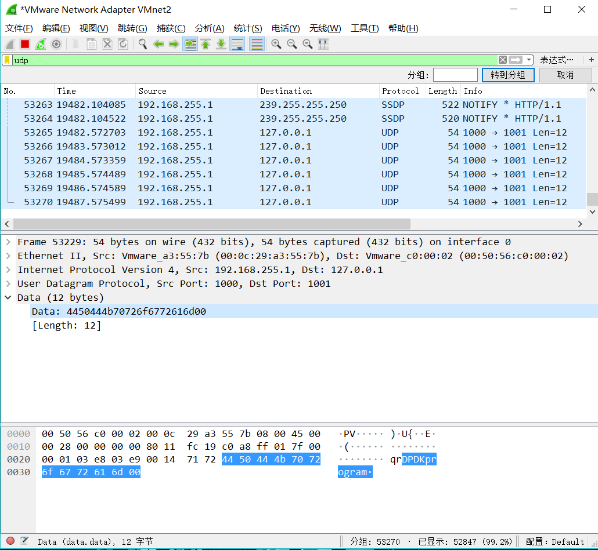
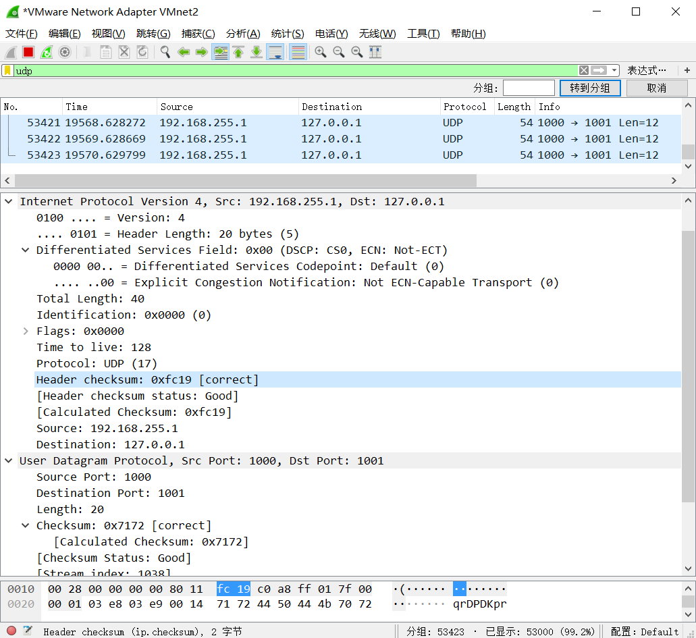

# Lab2 Report

Student ID: 516030910422 
Name: 赵樱

## Part1：Get Familiar With DPDK 
### Q1: What’s the purpose of using hugepage?

- 利用内存大页可以存更多TLB索引，降低TLB miss, 减少访存的开销、提升性能。

### Q2: Take examples/helloworld as an example, describe the execution flow of DPDK programs?
    
1. main函数：主线程运行入口。
2. 调用rte_eal_init函数：初始化基础运行环境。该函数读取入口参数，构建一个针对包处理设计的运行环境，其中一个参数```" -c <core mask>"``` 指定需要参与运行的线程（核）集合。
3. 程序会试图独占运行在逻辑核(lcore)上，进行多核运行初始化。```RTE_LCORE_FOREACH_SLAVE()```遍历所有指定可以使用的lcore; 通过```rte_eal_remote_launch()```在每个lcore上启动从线程，每个从线程都运行```lcore_hello()```函数，打印出相应的lcore_id。

### Q3: Read the codes of examples/skeleton, describe DPDK APIs related to sending and receiving packets.

```
// 收发包前的设备、队列、接口的配置和初始化
rte_eth_dev_configure()
rte_eth_rx_queue_setup()
rte_eth_tx_queue_setup
rte_eth_dev_start(port)

// 收包函数, 参数:端口id, 队列id, 缓冲区, 队列长度, 将收到的包放入缓冲区中。
rte_eth_rx_burst(port_id, queue_id, rte_mbuf, nb_pkts)

// 发包函数, 参数：端口id, 队列id, 缓冲区, 发包数, 发送缓冲区的nb_pkts个包
rte_eth_tx_burst(port_id, queue_id, rte_mbuf, nb_pkts)

// 发送失败的包需要手动调用该函数释放
rte_pktmbuf_free(mbuf)
```
  
### Q4: Describe the data structure of ‘rte_mbuf’.
- 是dpdk报文的封装结构，包含data、时间戳、接口、包类型等一系列包的信息。
- 指针buf_addr:指向segment buffer
- reference counter和data：需要复制mbuf时将old buf的ref_cnt++, 共享data；free mbuf时也是将ref_cnt减至0再释放空间。
- next：指向下一个segment buffer
- pkt_len和data_len：表明mbuf全部/data的长度。

## Part2: Send Packets With DPDK
- 程序运行：
```shell
$ cd dpdk_program
$ make
$ sudo ./build/udp -c 1
```



- 从VMnet2捕获到dpdk发送的包，正确识别出包头Ethernet、ipv4、UDP格式
- 读取出包中 "DPDKprogram" 的data  	
- Ethernet: 相符的MAC地址



- IPv4：相符的src ip(192.168.255.1), dst ip(127.0.0.1), Time to live, Total length
- UDP：相符的端口(1000 → 1001)
- 开启Wireshark的checksum检测，ipv4和udp的checksum均正确。